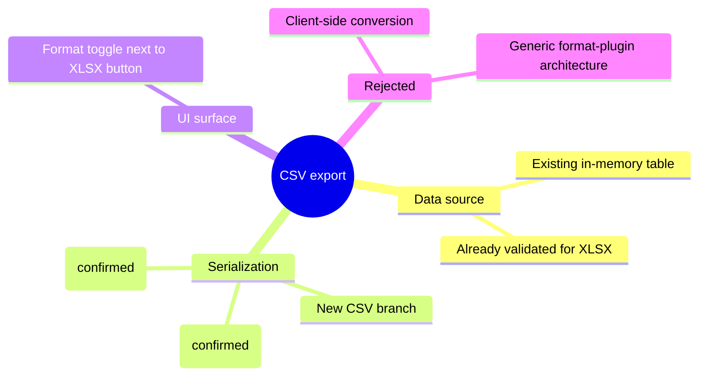

# Example: stdd-explore handoff summary

This is a worked example of the artifact `stdd-explore` hands off at the end
of a session (per `STDD/specs/stdd-explore.md` S-45). It is NOT itself a gated
artifact — it is a conversational summary, optionally pasted into `spec.md`'s
prose by `stdd-spec` when that file is created. The one exception that IS
written directly to `spec.md` (when it already exists) is the "Rejected
options" section below (Step 6 of `SKILL.md`).

Fictional example change: "add CSV export next to the existing XLSX export".

---

## Idea

Add a CSV export option alongside an existing XLSX export, so users who need
plain-text output for downstream tooling (spreadsheets that don't like binary
formats, git-diffable fixtures) don't have to convert XLSX by hand.

## First-principles trace (six phases, abbreviated)

- **Phase 0 — Delete first**: could this be solved by just documenting "open
  the XLSX and File > Save As CSV"? No — the ask is for an in-product export
  button, because the XLSX round-trip loses formatting decisions users don't
  want to make manually every time.
- **Phase 1 — Problem essence**: users need a lossless-enough plain-text
  representation of the same tabular data already produced for XLSX.
- **Phase 2 — Challenged assumptions**: assumed "CSV" implies UTF-8 with
  comma delimiters — not safe, some downstream tools expect Big5 or
  semicolon delimiters for locale reasons. Flagged for the user to confirm.
- **Phase 3 — Ground truths**: the XLSX export already has a single
  in-memory tabular representation before it's serialized to XLSX; that
  representation is delimiter/encoding-agnostic.
- **Phase 4 — Upward reasoning**: add a second serializer branch consuming
  the same in-memory representation, selectable via a `format` parameter.
- **Phase 5 — Verification**: this still traces back to Phase 3 — no new
  data-shape assumption was introduced, only a new serializer.

## Restate-to-confirm checkpoints

- "So the CSV output should represent exactly the same rows/columns as the
  XLSX export, just serialized differently — is that right, or do you also
  want a reduced column set for CSV?" → user confirmed: same columns.

## Questions asked (batch 1 of 1, 3 of the ≤8 budget used)

1. Encoding: UTF-8, or does a downstream tool require Big5?
2. Delimiter: comma, or semicolon for locale reasons?
3. Should the CSV button live next to the XLSX button, or in a format
   dropdown?

## Options considered

1. **New serializer branch off the existing in-memory table** (recommended)
   — smallest surface area, reuses validation already applied for XLSX.
2. **Separate CSV-only code path from the raw DB query** — more isolated,
   but duplicates row-shaping logic already written for XLSX.
3. **Client-side conversion of the XLSX blob to CSV in the browser** —
   avoids a backend change entirely, but pushes parsing complexity to the
   frontend and breaks if the XLSX format ever changes shape.

Recommended: Option 1 — least duplication, and any future third format
(e.g. TSV) follows the same pattern.

## Rejected options

(This heading is the exact section `stdd-spec` writes verbatim into
`spec.md`'s `## Rejected options` when it creates the file — see
`SKILL.md` Step 6. It is not part of the approval gate and not included in
the two-file fingerprint calculation.)

- **Client-side XLSX-to-CSV conversion (Option 3 above)** — rejected: parsing
  binary XLSX in the browser duplicates backend logic and breaks silently if
  the XLSX schema changes; no test coverage would catch the drift.
- **A generic "any format" plugin architecture** — rejected: no third real
  consumer beyond CSV/XLSX exists yet; a config/registry-driven design is
  worth building once a third format is real, not speculatively ahead of it.

## Recommendation for next phase

No UI-facing interaction surface beyond an existing button (a same-page
format toggle) → propose calling `stdd-spec` directly, skipping `stdd-uiux`.

## Optional: Mermaid mindmap appendix

The mindmap below is a **thinking aid only** — it is not verified, not
gated, and not part of the two-file fingerprint. It is one of the two
Mermaid diagram types this project allows for exploratory/appendix use.

Banned Mermaid constructs: single source of truth is `stdd-lint`'s
`references/checklist.md` — not restated here.

