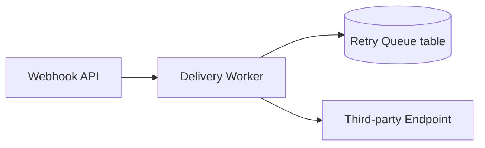
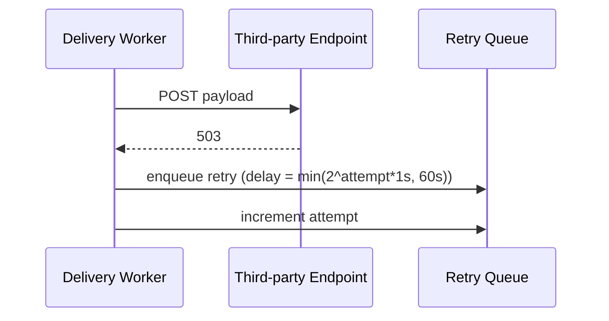
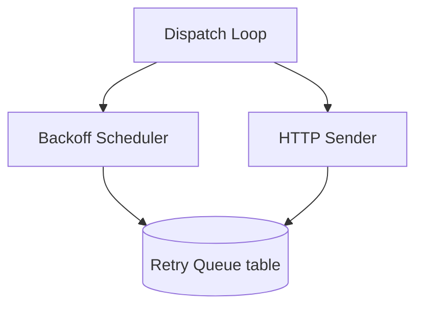

# design-be: Webhook Retry Queue

Implements `REQ-01`, `REQ-02` (see `STDD/webhook-retry-queue/spec.md`).

## BE plan

The delivery worker gains a retry queue backed by the existing job-queue
table. No new service is introduced — retry scheduling is a new job type on
the existing worker.

## Table schema

| Column | Type | Notes |
|---|---|---|
| `id` | uuid | primary key |
| `webhook_id` | uuid | FK to `webhooks.id` |
| `attempt` | int | starts at 0, max 5 (REQ-01) |
| `status` | enum(`pending`,`failed`,`delivered`) | REQ-01 |
| `next_attempt_at` | timestamptz | null once `status != pending` |

## Services relationship

## Sequence: retry on 5xx (REQ-01, S-01)

## C3 (Component) — Delivery Worker internals (conditional, this change splits it)

Plain Mermaid `graph` syntax only (banned constructs: single source of truth
is `stdd-lint`'s `references/checklist.md` — not restated here).

## N/A sections

- Auth/authz changes: N/A — this change reuses the existing webhook API's
  existing auth.
