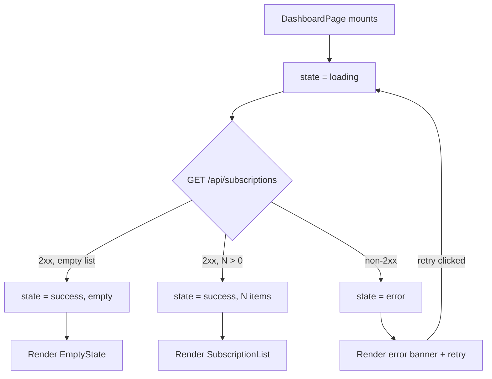

# design-fe: Subscription Dashboard

Implements `REQ-01`, `REQ-02` (see `STDD/example-user-dashboard/spec.md`).
Component layout, tokens, and states below follow the decisions already made
in `STDD/example-user-dashboard/design-ux.md` — this file does not redefine
them, only maps them onto concrete frontend structure.

## Component structure (REQ-01)

Mirrors `design-ux.md`'s component hierarchy section:

- `DashboardPage` — route-level container, fetches the subscription list on
  mount.
  - `SubscriptionList` — renders `SubscriptionCard` per item, or
    `EmptyState` when the list is empty (see design-ux.md "States").
    - `SubscriptionCard` (× N) — presentational, receives one subscription
      record as props.
    - `EmptyState` — shown instead of the list when N = 0; CTA per
      design-ux.md.

## State / data flow (REQ-01)

- **Data source**: `GET /api/subscriptions` (see `api.yml` — the shape lives
  there only, not redefined here).
- **Load states**: `idle` → `loading` → `success` | `error`, matching the
  Loading/Error states defined in `design-ux.md`.
  - `loading`: `SubscriptionList` renders skeleton cards (design-ux.md
    "States" — not a generic spinner).
  - `error`: inline banner with a retry action; retry re-enters `loading`.
  - `success` with zero records: `EmptyState` is rendered instead of
    `SubscriptionList`'s card grid.
- **Ownership**: `DashboardPage` owns the fetch and the four-state machine
  above; `SubscriptionCard` and `EmptyState` stay presentational (no fetch
  logic of their own).

## Responsive behavior (REQ-01)

Follows `design-ux.md`'s "Override — Subscription list page" delta: below
the `640px` breakpoint, `SubscriptionList` switches from a grid layout to a
single-column stack; no component-level logic changes, only the CSS layout
mode driven by the `space.card-gap` token defined in design-ux.md.

## N/A sections

- Bulk-export UI: N/A for this change — `design-ux.md`'s requirements
  checklist defers it to a later change (REQ-02).
