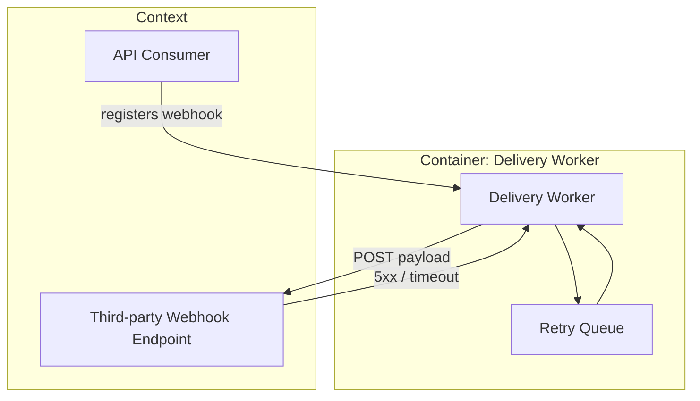

# Spec: Webhook Retry Queue

## Capability: Retry failed outbound webhook deliveries

### REQ-01: Retry a failed webhook delivery with backoff

The system SHALL retry an outbound webhook delivery up to 5 times with
exponential backoff when the receiving endpoint returns a 5xx status or
times out.

#### S-01: A 5xx response schedules a retry

- **GIVEN** an outbound webhook delivery attempt receives a `503` response
- **WHEN** the delivery worker processes the response
- **THEN** it SHALL:
  - enqueue a retry with delay `min(2^attempt * 1s, 60s)`
  - increment the delivery's `attempt` counter
  - leave the delivery `status` as `pending` (not `failed`) while
    `attempt < 5`

**Test mapping**: `tests/webhook/test_retry_scheduling.py::test_5xx_schedules_retry`
**Verification command**: `pytest tests/webhook/test_retry_scheduling.py::test_5xx_schedules_retry -q`

#### S-02: Exhausting retries marks the delivery failed

- **GIVEN** a delivery has reached `attempt == 5` and the latest attempt
  still returns a 5xx response
- **WHEN** the delivery worker processes this final response
- **THEN** it SHALL mark the delivery `status: failed` and SHALL NOT
  schedule any further retry

**Test mapping**: `tests/webhook/test_retry_scheduling.py::test_exhausted_retries_marks_failed`
**Verification command**: `pytest tests/webhook/test_retry_scheduling.py::test_exhausted_retries_marks_failed -q`

### REQ-02: Expose delivery status via the existing webhook API boundary

#### S-03: Delivery worker talks to an external receiving endpoint

- **GIVEN** the retry queue needs to model the system boundary between our
  delivery worker and third-party receiving endpoints
- **WHEN** the spec needs to communicate this boundary
- **THEN** it includes the following C1/C2 diagram (plain Mermaid
  `graph`/`flowchart` syntax only; banned constructs: single source of truth
  is `stdd-lint`'s `references/checklist.md` — not restated here):

**Test mapping**: manual — review this diagram against the actual delivery
worker's dependency graph
**Verification command**: manual review; no automated check for diagram
accuracy

## Rejected options

- Fixed-delay retry (no backoff): rejected — would hammer a struggling
  receiver at a constant rate instead of backing off.
- Unlimited retries: rejected — no bound on worker/queue growth for a
  permanently dead endpoint.

## Requirements Checklist

- [x] Retry scheduling with exponential backoff (REQ-01)
- [x] Exhaustion marks delivery failed (REQ-01)
- [x] System-boundary diagram for the delivery worker (REQ-02)

## Adjudications

- REQ-01: SURVIVED — no objection
- REQ-02: REFUTED → revised to keep the API contract change out of this
  spec's scope; boundary diagram only, contract lives in a later `stdd-plan`
  `api.yml`
